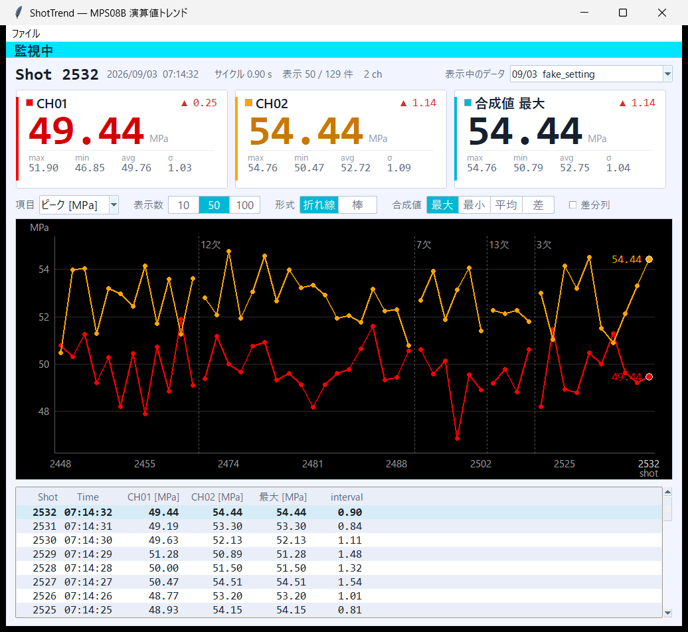
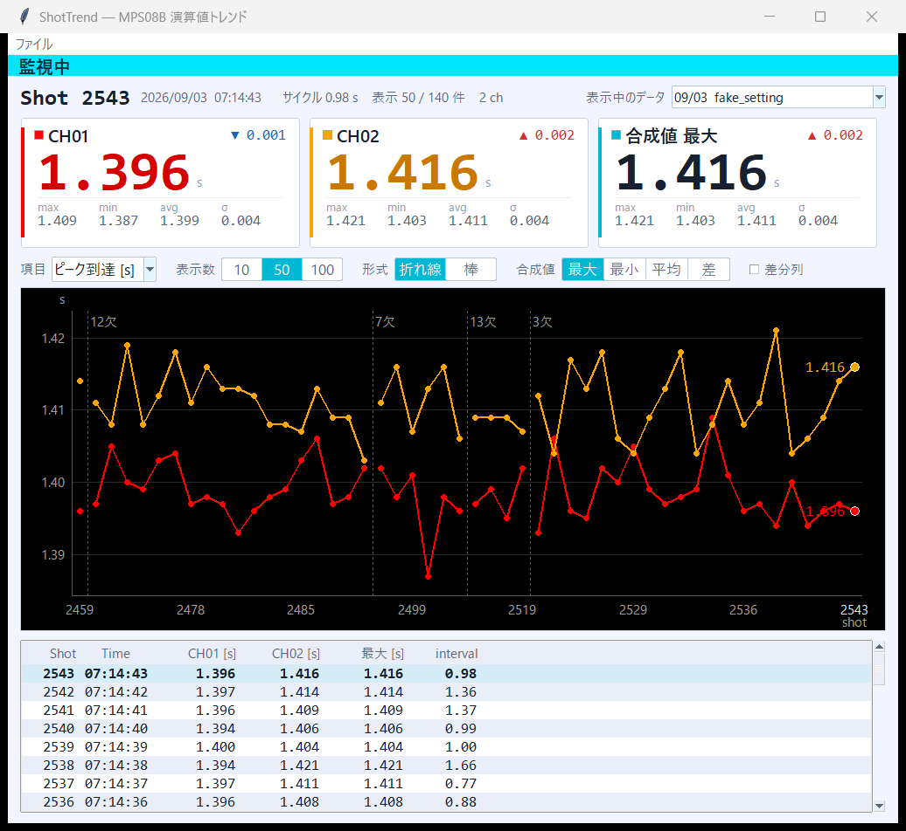

# ShotTrend

**1 ショット 1 行の CSV を追従して、ショットごとの値の推移を数値で見せる**常駐デスクトップアプリ。

射出成形の金型内圧モニタリングシステム **Futaba MPS08B (Mold Marshalling System)** が出力するサマリ CSV に対応。ショットごとの演算値（ピーク圧力・積分値・ピーク到達時間など）の履歴を、最新値・前ショットとの差・統計・グラフ・テーブルで**一目で読める形**にする。



- Windows 用の単体 exe を配布。現場 PC に **Python は要らない**
- 依存は Python 標準ライブラリのみ（tkinter は Python 同梱）。ソースから動かす場合も追加インストール不要
- チャンネル数は固定せず、本体アプリの最大構成である 32ch（アンプ 4 台）まで受け入れる

## なぜ作ったか

MPS08B には純正のトレンドビューアがあり、ピーク値の折れ線を描いてリアルタイム更新もする。だが**グラフに数値が一切出ない** — 値を知るにはグラフ上をクリックしてステータスバーに1点だけ表示させる必要がある。横軸も `0,1,2...` の連番で実ショット番号が出ず、使っていない CH03〜CH08 がゼロのまま統計表を占領する。

現場で欲しいのは「最新ショットと直近Nショットの値が**一目で読める**こと」なので、そこだけに絞って作った。

## インストール

### 配布版（推奨）

1. [Releases](https://github.com/shostako/shottrend/releases) から `shottrend-<version>-win64.zip` を落として展開する
2. 展開したフォルダを好きな場所に置く（`C:\Tools\shottrend\` など）。**書き込みできる場所**にすること。設定ファイル `config.json` とログ `logs\` は exe の隣に作られる
3. `shottrend.exe` を起動する

初回は Windows SmartScreen が「WindowsによってPCが保護されました」と出す（コード署名していないため）。「詳細情報」→「実行」で進める。2回目以降は出ない。

起動しない・すぐ消えるときは `logs\app.log` を見る。exe はコンソールを持たないので、エラーはすべてここに出る。

更新は Releases の `shottrend.exe` 単体を落として上書きすればよい（zip を展開し直す必要はない）。`config.json` はそのまま使える。

**v0.2.0 以前（`shot-monitor.exe`）から上げる場合**: 同じフォルダに `shottrend.exe` を置いたら、古い `shot-monitor.exe` は削除し、デスクトップ等のショートカットは張り替える。2 本とも残すとどちらを起動しても同じ `config.json` と `logs\` を奪い合う。

### ソースから

Python 3.12 以上が入っていれば、リポジトリを clone してそのまま動く。

```bat
py -3.12 app.pyw
```

コンソールを出したくない場合は `pythonw.exe app.pyw`。

## 使い方

### 初回設定

起動すると MMS_DATA フォルダを聞かれる。MPS08B 本体アプリのインストール先にある `MMS_DATA` を指定する（例: `C:\Users\<user>\Documents\MPS08B_Application_1_3_0_5\MMS_DATA`）。設定は `config.json` に保存され、以後は自動で読み込まれる。あとから変えるにはメニューの「ファイル > MMS_DATA フォルダを選ぶ...」。

本体アプリと同時に動かして問題ない。計測中でもファイルは読める（本体は `FileShare.ReadWrite` で開いている）。

### 表示言語

メニューの「言語 / Language」から選ぶ。選んだ瞬間に画面を組み直すので、再起動は要らない。
選択は `config.json` に残る。初回は OS の表示言語から推測し、判別できなければ日本語。

測定に関わる用語（項目名など）は MPS08B 本体アプリ（PPSB v1.3.0.5）の表記に合わせてある。
本体と違う言葉で同じ値を呼ぶと現場で混乱するため。単位（`MPa` / `MPa·s` / `s`）、`CH01` などの
ch 名、テーブルの `Shot` / `Time` / `interval`（MPS08B の CSV の列名そのもの）は訳さない。

英語のラベルは日本語より横に長いので、**ウィンドウの最小幅は言語によって変わる**
（コントロールバーが 1 行に収まる幅を実測して決める）。

### 画面

上から順に:

| 部位 | 中身 |
|---|---|
| 状態帯 | **監視中**（シアン）／**停止中**（黄）／データなし／データフォルダ未設定／読み取り異常。離れた位置から色で分かる |
| ショット行 | 最新ショット番号・時刻・サイクル・表示件数／総件数・使用 ch 数。右端で表示するデータ（日付・設定名）を切り替えられる |
| カード | **ch ごとの最新値**を大きく表示。前ショットとの差（▲▼）、表示中N件の max / min / avg / σ。ch が 4 本以上ならカードは小型版へ自動で切り替わる |
| 合成値カード | 1 ショット内の全 ch から求める **最大／最小／平均／差** を 1 枚。テーブルの合成値列と常に同じものを指す |
| コントロールバー | 項目・表示数（10 / 50 / 100）・形式（折れ線／棒）・合成値・差分列 |
| グラフ | 横軸は等間隔で、目盛に実ショット番号。中断は破線で区切り欠けたショット数を添える。最新点に数値を併記 |
| テーブル | Shot / Time / 各 ch / 合成値 / interval。最新が上。「差分列」で前ショットとの差と ch 間のばらつきを足せる |

表示するのは**一度でも非ゼロの値が来た ch** だけ。MPS08B は未接続の ch も `0.00` を書き続けるため、列の有無では使用中か判別できない。

配色は MPS08B 本体に倣い、**明るい地（`#F2F5FF`）にグラフエリアだけ黒**。線色は本体 `init.xml` の `waveColor` 8 色（CH01=赤、CH02=橙…）を巡回するので、本体の波形画面と並べたときに同じセンサが同じ色で見える。

### 表示できる項目

コントロールバーの「項目」で切り替える。**全 ch 共通で 1 項目**（ch ごとに変えると縦軸が 1 本のグラフに載らず、ch 間の比較も合成値も意味を失う）。表示名は本体アプリの演算値プルダウンに合わせてある。

| 表示名 | CSV の列 | 単位 | 桁 |
|---|---|---|---|
| ピーク | `CHnn_peak` | MPa | 2 |
| 積分値 | `CHnn_integral` | MPa·s | 2 |
| ピーク到達 | `CHnn_peak_time` | s | 3 |
| ピーク積分 | `CHnn_peak_integral` | MPa·s | 2 |
| t秒後値 | `CHnn_pointMonitor` | MPa | 2 |
| 区間平均値 | `CHnn_section_average` | MPa | 2 |
| 区間積分1 / 2 | `CHnn_section_integral_1` / `_2` | MPa·s | 2 |
| 突出ピーク | `CHnn_eject_Monitor` | MPa | 2 |
| 立上り時間 | `CHnn_RisingTime` | s | 3 |
| 立下り時間 | `CHnn_FallingTime` | s | 3 |

単位はヘッダに書かれていないため量の意味から付けている。積分の `MPa·s` は推定。



### 実機なしで動作確認する

成形機が止まっている時間帯でも、追記シミュレータで挙動を確認できる。

```bash
python tools/fake_writer.py --root /tmp/fake_mms --interval 2

# 多 ch の画面確認
python tools/fake_writer.py --root /tmp/fake_mms --interval 2 --channels 8
```

別途アプリ側の MMS_DATA をそのフォルダに向ける。中断（ヘッダ再挿入＋ショット番号の飛び）も再現され、ピーク以外の項目もそれらしい値で埋まる。

## 設定ファイル

`config.json`（exe またはソースの隣）。GUI で変えた内容は即座に保存される。手で編集してもよく、不正な値は既定値に丸められる。

| キー | 既定 | 意味 |
|---|---|---|
| `mms_data_dir` | `""` | MPS08B の `MMS_DATA` フォルダ |
| `poll_interval_ms` | `2000` | CSV を見に行く間隔。250〜60000 |
| `session_rescan_ticks` | `10` | 何回のポーリングごとに最新フォルダを探し直すか |
| `window_size` | `50` | 表示するショット数。10 / 50 / 100 |
| `chart_kind` | `"line"` | `line`（折れ線）または `bar`（棒） |
| `metric` | `"peak"` | 表示項目。上の表の「CSV の列」の `CHnn_` を除いた部分 |
| `composite_mode` | `"max"` | 合成値。`max` / `min` / `avg` / `diff` |
| `show_delta_columns` | `false` | テーブルに差分列を出すか |
| `language` | `""` | 表示言語。`""` は OS の表示言語から自動判別。`ja` / `en` |
| `geometry` | `"1280x880+30+16"` | ウィンドウの大きさと位置。終了時に保存 |

## データ源

MPS08B が書く日次サマリ CSV だけを読む。生波形（`ALL_*.csv`、1 ショット 8000 行 / 約 390KB）は読まない。

```
<MMS_DATA>/<設定名>_<日付>/
    <設定名>_<日付>.csv       ← これだけ使う（1 行 = 1 ショット、追記型）
    ALL_*.csv                 ← 生波形（使わない）
```

104 列のうち使うのは `DateTime` / `interval` / `Shot` と、項目ごとに `CH01_<項目>` から連番で見つかるだけの `CHnn_<項目>`（`error` は使わない）。列は位置ではなく**名前で引く**。

### 実データで確認した癖への対処

| 癖 | 対処 |
|---|---|
| 計測を中断→再開するたびに**ヘッダ行がファイル途中へ再挿入される**（実測: 247 行中 6 回） | 行ごとに判定してスキップし、列マップを作り直す |
| **ショット番号は飛ぶが巻き戻らない**（中断で最大 21 ショット欠落） | shot_no をキーに重複排除して冪等性を担保。グラフは等間隔カテゴリ軸にしてラベルに実番号を出す |
| 保存先フォルダ名が日付でも設定名でも変わり、**同日に 2 フォルダ併存する**。`separate_20260219` / `_20260828` のような名前も実在 | 名前ソートを一切使わず、**CSV の mtime** で最新を判定 |
| `interval` が固定でない（実測 0.0〜1,288,852 秒） | 「止まっている」判定の閾値を直近 10 ショットの中央値×3（90〜600 秒でクランプ）で決める |
| CRLF・末尾カンマ（最終列は常に空）・データ 0 行の CSV が実在 | 全部許容する |
| 追記中に読むと最終行が途中で切れている | 改行で終わらない断片は保留し、完結してから採用する |
| ピーク以外の列が壊れている | ピークが読めていれば行は捨てず、その項目だけ 0.0 で埋める |

## 構成

```
app.pyw              エントリポイント。ログ設定と例外の捕捉
shottrend/
  core/     ← Tk を一切 import しない層。pytest で全部検証できる
    metrics.py    表示項目の一覧（単位・桁数の単一ソース。表示名は i18n）
    models.py     Shot / Session
    config.py     設定の読み書き（原子的書き込み）
    discovery.py  mtime による最新セッション判定
    csvsource.py  差分読み（最も壊れやすい場所）
    history.py    shot_no キーの履歴（冪等性の要）
    stats.py      統計・合成値
    monitor.py    ポーリング 1 回分の判断
    version.py    バージョン番号
  ui/       ← tkinter。core を呼ぶだけ
  i18n/     ← 画面に出す文言。言語ごとの dict モジュール
tools/
  fake_writer.py  追記シミュレータ
  build.py        配布物の作成（Windows）
shottrend.spec       PyInstaller の定義
```

## 開発

Python 3.12 以上。

```bash
uv venv --python 3.12 .venv && uv pip install --python .venv/bin/python -e ".[dev]"
.venv/bin/python -m pytest
.venv/bin/ruff check . && .venv/bin/ruff format --check .
```

（`uv` が無ければ `python3.12 -m venv .venv && .venv/bin/pip install -e ".[dev]"`）

CI（GitHub Actions）は master への push と PR で `ruff check` / `ruff format --check` / `pytest` を回す。PR を開くと Claude が自動でレビューを付ける（修正 push では再発火しないので、直したうえで見直してほしいときは PR に `@claude` とコメントする）。

GUI の見た目はテストで検出できない。UI を触ったら必ず Windows で起動して画面を確認する。WSL 上のソースを Windows の Python から直接動かせる: `py -3.12 \\wsl.localhost\<distro>\home\<user>\ClaudeCode\shottrend\app.pyw`。

## ビルドとリリース

配布物は Windows 上で作る（PyInstaller はクロスビルドできない）。

```bat
py -3.12 -m pip install -e ".[dev,build]"
py -3.12 tools\build.py
```

`dist\shottrend.exe` と `dist\shottrend-<version>-win64.zip` ができる。

リリースは **タグを push するだけ**。

```bash
# 1. shottrend/core/version.py の __version__ を上げ、CHANGELOG.md に節を切ってマージする
# 2. タグを打つ
git tag -a v0.2.0 -m "v0.2.0"
git push origin v0.2.0
```

GitHub Actions（`release.yml`）が Windows で lint・テスト・ビルドを通し、CHANGELOG の該当節を本文にして Release を作り、exe と zip を添付する。タグと `shottrend/core/version.py` が食い違っていれば止まる。

## 既知の制限

- コード署名していないので初回起動で SmartScreen が出る
- 単体 exe は起動時に一時フォルダへ展開するため、初回起動に数秒かかる
- 積分系の単位 `MPa·s` は本体の表示で確認していない（推定）
- 対応言語は日本語と英語のみ（繁体中文・简体中文・한국어は用意中）

## ライセンス

[MIT](LICENSE)。Futaba、MPS08B、Mold Marshalling System は双葉電子工業株式会社の商標または製品名で、本ソフトウェアは同社とは無関係の非公式ツール。
